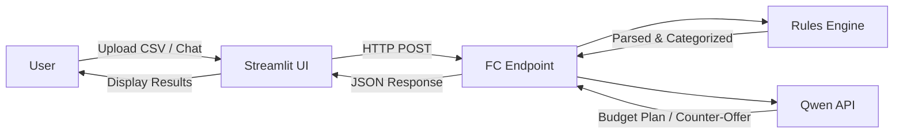

# Architecture

## Overview

Budget Negotiator is a hybrid AI agent that analyzes spending data and negotiates budget cuts through conversation. Unlike a spreadsheet, it reasons about tradeoffs on every turn using Qwen API.

> *Figure 1: System architecture — data flows from user input through the rules engine and Qwen API, then back as a budget plan.*

## Components

### Streamlit UI
- Chat interface for user interaction
- File upload for CSV spending data
- Plotly charts for spending visualization

### Alibaba Cloud Function Compute
- Serverless backend for agent logic
- Python runtime with Qwen API integration
- Entry point: handler.py
- **Live endpoint:** (insert URL after deployment)

### Rules Engine
- CSV parsing and validation
- Transaction categorization (essential vs discretionary)
- Deterministic, no API cost

### Qwen API (dashscope)
- Budget reasoning and cut proposals (initial analysis)
- Conversational negotiation (every turn)
- Natural language explanations

## Data Flow

### Initial Analysis
1. User uploads CSV or selects demo data
2. Streamlit sends transactions to FC endpoint
3. Rules Engine parses and categorizes
4. Qwen API reasons about cuts
5. Response returned to Streamlit

### Negotiation (Every Turn)
1. User types objection in natural language
2. Streamlit sends: categorized data + previous plan + user text to FC
3. FC calls Qwen with full context
4. Qwen reasons about the tradeoff and adjusts plan
5. Updated plan returned to Streamlit

## Error Handling

- Malformed CSV → structured error response
- Qwen API timeout → fallback to previous plan
- Invalid input → validation before processing
